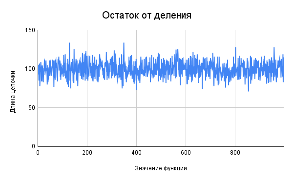
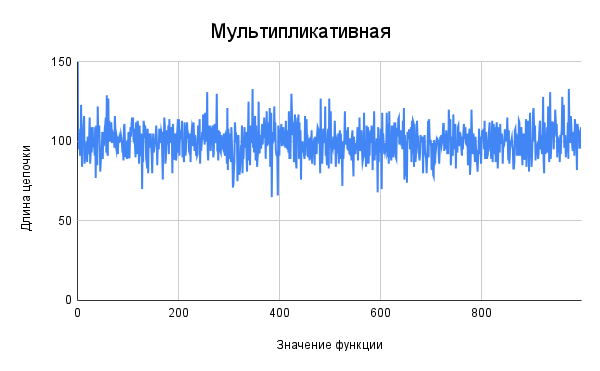
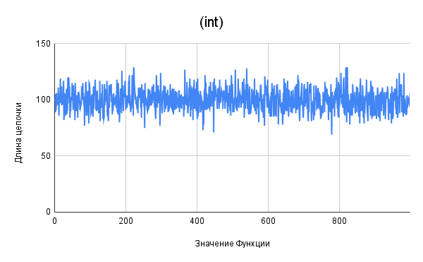
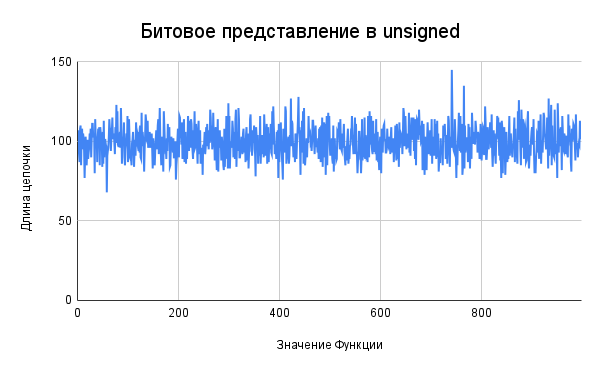
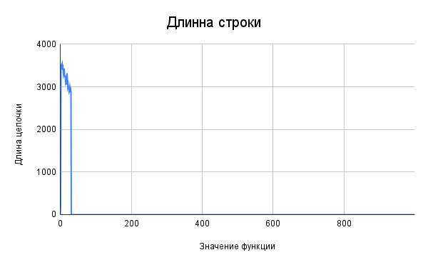
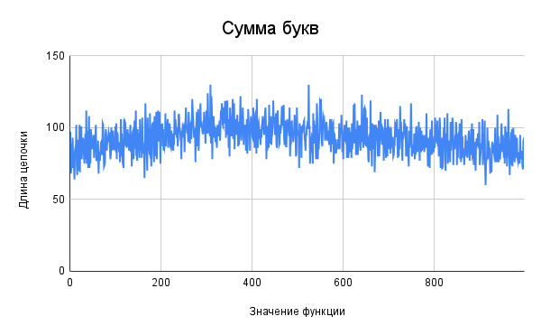
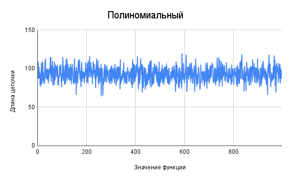
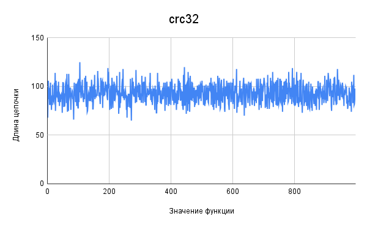
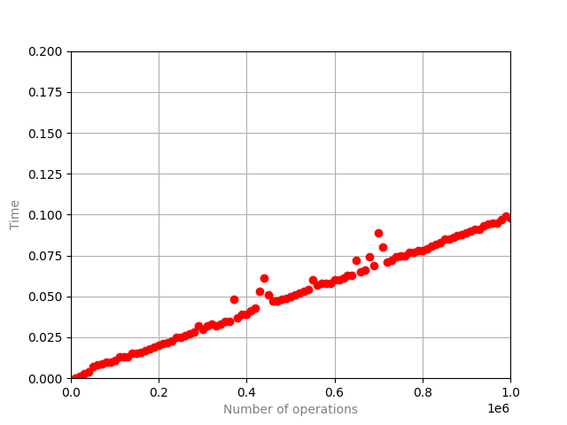

# Хэширование

## Исследование Хэш-Функций

В ходе работы было сгенерировано по 1000000 случайных ключей для каждого из трёх типов: int, float и строк длиной от 0 до 31 символов.

Для хеширования применялись следующие функции:

### Для типа int:

#### Остаток от деления на 1000

```C
uint64_t IntHash1 (void *key)
{
    return (*(unsigned int *) key) % 1000;
}
```

#### Мультипликативная

```C
uint64_t IntHash3 (void *key)
{
    double f = (double)(*((int *) key)) * 0.54321;
    f = f - int(f);

    return (unsigned int)(f * 1001);
}
```

### Для типа float:

#### Целая часть

```C
uint64_t FloatHash1 (void *key)
{
    return (int)(*(float *) key);
}
```

#### Битовое представлениие

```C
uint64_t FloatHash2 (void *key)
{
    return *(unsigned int *) key;
}
```

### Для строк:

#### Длина строки

```C
uint64_t StrHash1 (void *key)
{
    return strlen ((const char *) key);
}

```

#### Сумма букв

```C
uint64_t StrHash2 (void *key)
{
    const unsigned char *str = (const unsigned char *) key;
    uint64_t hash = 0;

    while (*str != '\0') hash += *(str++);

    return hash;
}
```

#### Полиномиальный

```C
uint64_t StrHash3 (void *key)
{
    const unsigned char *str = (const unsigned char *) key;
    uint64_t hash = 0;

    while (*str != '\0') hash = hash * 257 + *(str++);

    return hash;
}
```

#### crc32

```C
uint64_t Crc32Hash (void *key)
{
    const char *str = (const char *) key;
    uint32_t ret = 0xFFFFFFFF;

    while (*str != '\0')
    {
        ret ^= *(str++);

        for (int i = 0; i < 8; i++)
        {
            ret = (ret & 1) ? (ret >> 1) ^ 0xEDB88320 : ret >> 1;
        }
    }
    return ret;
}
```

### Аналииз и сравнение функций

Ключи были загружены в хеш-таблицу размером 1000.\
Средняя длина цепочки - 100.

Для каждой функции был построен график зависимости длины цепочки от хеша.

### int




Обе функции хорошо справились со своей задачей и длины всех цепочек не сильно отличаются от 100.
Это произшло, потому что диапазон значений обеих функций больше размера хеш-таблцы и ключи случайны.

### float




Снова обе функции хорошо распределили ключи по цепочкам по тем же причинам.

### Строки






С последними двумя функциями всё хорошо.
Рассмотрим первые две.

Первая функция плохо распределила ключи по таблице, т.к. длина строки меньше 32 в то время, как размер таблицы гораздо больше 32.\
Также можем заметить, что у второй функции цепочки короче при маленьких значениях функции. Это обусловлено тем, что вероятность генерации строки с маленькой суммой меньше, чем с большой.

### Вывод
При выборе хеш-функции следует обращать вниамние на специфику входных данных и размеры таблицы.
Для хеширования строк не стоит применять длину строки.

## Исследование Хеш-таблиц

Для исследования хеш-таблиц построим график зависимости времмени работы от количества опреаций.
Операции: вставка, удаление, поиск. Все операции равновероятны.



